# Multi-Agent Slack System - Complete Architecture Documentation

## Table of Contents
1. [System Overview](#system-overview)
2. [Architecture Components](#architecture-components)
3. [Core Logic Flow](#core-logic-flow)
4. [Component Deep Dive](#component-deep-dive)
5. [Configuration System](#configuration-system)
6. [Tool Framework](#tool-framework)
7. [Inter-Component Communication](#inter-component-communication)
8. [Threading Model](#threading-model)
9. [Error Handling & Resilience](#error-handling--resilience)
10. [Extension Points](#extension-points)
11. [Recent Enhancements](#recent-enhancements)
12. [DSPy Integration](#dspy-integration-with-beautifulsoup-search)

## System Overview

This codebase implements a **Slack-native multi-agent assistant system** where an Orchestrator bot coordinates between multiple specialized AI agents (specialists) to handle user requests. The system is built on top of Slack's Socket Mode for real-time communication and uses both the `smolagents` framework for LLM-powered tool execution and **DSPy (Declarative Self-improving Language Programs)** for enhanced reasoning and self-improvement capabilities.

### High-Level Architecture

```
┌─────────────────┐
│   Slack User    │
└────────┬────────┘
         │ @orchestrator help me...
         ▼
┌─────────────────┐     ┌──────────────────┐
│  Orchestrator   │────▶│ Coordination     │
│  (BaseAgent)    │     │ Channel          │
└─────────────────┘     └──────┬───────────┘
                               │ Evaluations
                               ▼
┌─────────────────┐     ┌──────────────────┐     ┌──────────────────┐
│ Writer Agent    │     │ Grok Agent       │     │ Researcher Agent │
│ (Specialist)    │     │ (Specialist)     │     │ (Specialist)     │
└─────────────────┘     └──────────────────┘     └──────────────────┘
```

## Architecture Components

### 1. **Entry Points**
- **`src/cli.py`**: Command-line interface with plugin system for runtime features
- **`src/main.py`**: Main application entry that bootstraps the entire system

### 2. **Core Framework** (`src/core/`)
- **`base_agent.py`**: Base Slack bot class with WebSocket connection management
- **`friendly_code_agent.py`**: Enhanced wrapper around smolagents CodeAgent with fallback execution and tolerant LLM parsing
- **`dspy_agent.py`**: DSPy-powered agent with Chain-of-Thought reasoning and BeautifulSoup search integration
- **`config_loader.py`**: YAML configuration loader with environment variable substitution
- **`utils.py`**: Utility functions for Slack mention sanitization and context formatting
- **`log_setup.py`**: Rich-based logging configuration

### 3. **Orchestration** (`src/orchestrator/`)
- **`assignment.py`**: Logic for polling specialist evaluations and task assignment
- **`handlers.py`**: Slack event handler registration for specialists

### 4. **Agents** (`src/agents/`)
- **`specialist_agent.py`**: Generic specialist implementation that loads agent profiles
- **`dspy_modules.py`**: Specialized DSPy modules for different agent types (Research, Writer, Analysis, Grok)

### 5. **Tools** (`src/tools/`)
- **`agent_tools.py`**: Domain-agnostic LLM-callable tools (web scraping, text analysis)
- **`beautiful_search.py`**: BeautifulSoup-based multi-engine search system (Google, Bing, Wikipedia, DuckDuckGo)
- **`slack_tools.py`**: Slack-specific tools (DM, channel posting, TTS)
- **`tts_tools.py`**: Text-to-speech tools using Edge-TTS (TextToSpeechTool, SlackTTSTool)
- **`slack_helpers.py`**: Low-level Slack posting utilities
- **`zoom_tools.py`**: Zoom meeting creation tools

### 6. **Integrations** (`src/integrations/`)
- **`zoom_client.py`**: Zoom REST API client with stub/live modes

### 7. **Configuration** (`configs/`)
- **`system_config.yaml`**: Central configuration for tokens, channels, API keys
- **`agents/*.yaml`**: Individual agent profiles (Grok, Writer)

## Core Logic Flow

### 1. **System Initialization**
```python
# main.py startup sequence:
1. Load environment variables from .env
2. Initialize Rich logging
3. Load system configuration (configs/system_config.yaml)
4. Create Orchestrator bot
5. Discover and load all specialist agents from configs/agents/
6. Register Slack event handlers for each bot
7. Start Socket Mode threads for all bots
8. Enter main event loop
```

### 2. **Request Processing Flow**

```mermaid
sequenceDiagram
    participant User
    participant Orchestrator
    participant CoordChannel as Coordination Channel
    participant Specialists
    participant AssignedSpec as Assigned Specialist

    User->>Orchestrator: @orchestrator "request"
    Orchestrator->>Orchestrator: Extract & sanitize request
    Orchestrator->>CoordChannel: Post evaluation request
    
    par Parallel Evaluation
        Specialists->>Specialists: evaluate_request()
        Specialists->>CoordChannel: Post confidence scores
    end
    
    Orchestrator->>Orchestrator: Poll for evaluations (8s timeout)
    Orchestrator->>CoordChannel: ASSIGNED: @SpecialistName
    
    AssignedSpec->>AssignedSpec: process_assignment()
    AssignedSpec->>User: Send result via DM/channel
    AssignedSpec->>CoordChannel: ✅ Task completed
```


### 3. **Task Assignment Algorithm**
```python
# In assignment.py:check_and_assign()
1. Poll coordination channel for specialist evaluations (8 second timeout)
2. Parse evaluation messages: "🧠 {Name} reporting: Confidence {X}%"
3. Select specialist with highest confidence score
4. Post assignment message: "ASSIGNED: @{specialist_bot_id}"
5. If no evaluations received or confidence too low, post failure message
```

## Component Deep Dive

### BaseAgent (`src/core/base_agent.py`)
The foundation class for all Slack bots in the system:

```python
class BaseAgent:
    - Initializes Slack Bolt App with authentication
    - Wraps Slack API calls with verbose logging
    - Manages ThreadSafeSocketModeHandler for WebSocket connection
    - Provides bot_user_id and bot_name properties
    - Handles reconnection logic automatically
```

Key features:
- **Verbose API logging**: All Slack API calls are logged with parameters and responses
- **Thread-safe WebSocket**: Custom handler that safely manages Socket Mode connection
- **Automatic reconnection**: Handles disconnections and reconnects automatically

### SpecialistAgent (`src/agents/specialist_agent.py`)
Generic implementation for all specialist bots:

```python
class SpecialistAgent(BaseAgent):
    Key methods:
    - _initialize_tools(): Dynamically loads tools from agent profile
    - evaluate_request(): Returns (can_handle, confidence_score)
    - process_assignment(): Executes the assigned task
```

**Tool Initialization Process:**
1. Read tool configurations from agent YAML profile
2. Import specified Python modules dynamically
3. Inject runtime dependencies (_client, _bot_name)
4. Collect decorated @tool functions
5. Pass tools to FriendlyCodeAgent

**Request Evaluation Logic:**
- Each specialist has custom logic based on keywords and patterns
- Returns confidence score 0-100%
- Examples:
  - Writer: High confidence for "write", "compose", "draft"
  - Grok: High confidence for URLs and "fetch"
  - Researcher: High confidence for questions ("what", "how", "why")

**Task Processing:**
- Simple requests (greetings, DMs): Handled directly
- Temperature conversions: Direct calculation without LLM
- Research queries (Grok): Direct execution of deep_research_tool for efficiency
- Complex requests: Passed to LLM agent with available tools
- Results sent via DM or channel based on context
- Special handling for TTS shortcuts (@tts or tts prefix)

### Configuration System
The system uses a two-tier configuration approach:

1. **System Config** (`configs/system_config.yaml`):
   - Environment variable placeholders: `${VAR_NAME}`
   - Loaded by `config_loader.py` with substitution
   - Contains tokens, API keys, channel IDs

2. **Agent Profiles** (`configs/agents/*.yaml`):
   ```yaml
   name: "AgentName"
   model_id: "claude-3-haiku-20240307"
   system_prompt: |
     Agent-specific instructions...
   tools:
     - module: "src.tools.module_name"
       functions: ["tool1", "tool2"]
   ```

### Tool Framework
Tools are decorated Python functions that LLMs can call. The system supports both smolagents tools and DSPy modules:

```python
# Smolagents tools (existing)
@tool
def tool_name(param1: str, param2: int = None) -> str:
    """Brief description for LLM.
    
    Args:
        param1: Description
        param2: Optional description
    """
    # Implementation
    return result

# DSPy modules (new)
class DSPyModule(dspy.Module):
    def __init__(self):
        super().__init__()
        self.predictor = dspy.ChainOfThought("input -> output")
    
    def forward(self, input_text: str) -> str:
        result = self.predictor(input=input_text)
        return result.output
```

**Tool Categories:**
1. **Generic Tools** (`agent_tools.py`):
   - `analyze_request_tool`: Intent classification
   - `fetch_and_summarize_tool`: Web scraping using BeautifulSoup
   - `web_search_tool`: Multi-engine search using BeautifulSoup scraping (no longer DuckDuckGo API)
   - `deep_research_tool`: Multi-angle research with fallback search engines

2. **Slack Tools** (`slack_tools.py`):
   - `slack_dm_tool`: Send direct messages
   - `slack_channel_tool`: Post to channels/threads
   - `slack_tts_tool`: Text-to-speech with edge-tts
   - `lookup_user_tool`: Resolve usernames to IDs

3. **TTS Tools** (`tts_tools.py`):
   - `TextToSpeechTool`: Convert text to MP3 file using Edge-TTS
   - `SlackTTSTool`: TTS with direct Slack upload integration

4. **Integration Tools** (`zoom_tools.py`):
   - `create_zoom_meeting`: Create meetings via API

5. **Search Engine** (`beautiful_search.py`):
   - `BeautifulSearch` class: Multi-engine web search and scraping
   - Supports Google, Bing, Wikipedia, and DuckDuckGo HTML
   - Configurable via system_config.yaml

## Inter-Component Communication

### 1. **Orchestrator ↔ Specialists**
- Communication via coordination channel (Slack channel)
- Structured message formats:
  - Evaluation request: `"Task: "{request}" @spec1 @spec2 please evaluate"`
  - Evaluation response: `"🧠 {Name} reporting: Confidence {X}%"`
  - Assignment: `"ASSIGNED: @{bot_user_id}"`

### 2. **Runtime Dependency Injection**
Tools receive dependencies via module-level variables:
```python
# In tool modules:
_client: WebClient = None  # Injected by SpecialistAgent
_bot_name: str = None      # Injected by SpecialistAgent
```

### 3. **Context Propagation**
Request context flows through the system:
```python
active_requests[thread_ts] = {
    'user_id': user_id,
    'channel_id': channel_id,
    'request': text,
    'timestamp': time.time(),
    'original_thread_ts': thread_ts,
    'context': context_messages
}
```

## Threading Model

The system uses multiple threading strategies:

1. **Main Thread**: Runs the primary event loop
2. **Socket Mode Threads**: One per bot for WebSocket handling
3. **Evaluation Threads**: Spawned for parallel confidence calculations
4. **Assignment Threads**: Execute specialist work asynchronously

```python
# Thread hierarchy:
Main Thread
├── Orchestrator Socket Thread
├── Writer Socket Thread  
├── Grok Socket Thread
└── Dynamic Threads
    ├── Evaluation Threads (short-lived)
    └── Assignment Threads (task execution)
```

## Error Handling & Resilience

### 1. **Connection Management**
- Automatic WebSocket reconnection with exponential backoff
- Rate limit handling with Retry-After header respect

### 2. **Graceful Degradation**
- Missing specialists are logged but don't crash the system
- Failed evaluations timeout after 8 seconds
- Tool errors return error strings instead of exceptions

### 3. **Cleanup Handling**
- `atexit` handlers ensure Socket Mode connections close
- KeyboardInterrupt handled gracefully
- Thread daemon flags prevent hanging on shutdown

## Extension Points

### 1. **Adding New Specialists**
1. Create YAML profile in `configs/agents/`
2. Add bot tokens to `.env` and `system_config.yaml`
3. Specialist automatically discovered on startup

### 2. **Adding New Tools**
1. Create `@tool` decorated function in `src/tools/`
2. Add to agent profile's tools list
3. Tool available to LLM immediately

### 3. **Plugin System** (via CLI)
```python
# In src/cli.py:
@plugin("feature_name")
def _feature_plugin(args):
    # Initialize feature based on CLI args
    os.environ["FEATURE_ENABLED"] = "1"
```

### 4. **Custom Integrations**
- Add client classes to `src/integrations/`
- Inject into tools via SpecialistAgent's initialization

## Key Design Decisions

1. **Socket Mode over Events API**: Chosen for firewall-friendly WebSocket connections
2. **Coordination Channel Pattern**: Centralized communication prevents direct bot-to-bot messaging
3. **Dynamic Tool Loading**: Agents can have different tool sets without code changes
4. **Tolerant LLM Parsing**: FriendlyCodeAgent handles prose around tool calls
5. **DSPy Integration**: Enhanced reasoning through Chain-of-Thought and self-improvement capabilities
6. **BeautifulSoup Search**: Reliable search without rate limits through HTML scraping
7. **Environment-based Config**: All secrets in environment variables for security
8. **Specialist Autonomy**: Each specialist independently evaluates and executes
9. **Graceful Timeouts**: 8-second evaluation window prevents indefinite waiting

## Performance Considerations

1. **Parallel Evaluations**: All specialists evaluate simultaneously
2. **Thread Pooling**: Reusable threads for Socket Mode handlers
3. **Cached User Lookups**: LRU cache for Slack user resolution
4. **Async TTS Generation**: Audio generation doesn't block main thread
5. **Lazy Imports**: Tools loaded only when needed by specialists

## Security Considerations

1. **Token Isolation**: Each bot has separate app/bot tokens
2. **Channel Scoping**: Bots only respond in coordination channel
3. **Sanitized Mentions**: User mentions converted to prevent pings
4. **No Direct Execution**: LLM outputs parsed, not eval()'d
5. **File Upload via External Services**: TTS uses file.io instead of Slack files API

## Recent Enhancements

### 1. **Enhanced FriendlyCodeAgent Integration**
The `FriendlyCodeAgent` class now properly integrates with smolagents while providing robust fallback mechanisms:
- Automatic detection of smolagents availability
- Manual tool call extraction from LLM responses when smolagents fails
- Support for multiple tool invocation formats (function(args), `function(args)`, code blocks)
- Comprehensive error handling and logging

### 2. **Direct Deep Research Execution**
The Grok specialist agent now includes optimized handling for research queries:
- Direct execution of `deep_research_tool` for research-related requests
- Bypasses LLM interpretation for faster, more reliable results
- Automatic topic extraction from various query formats
- Uses BeautifulSoup-based scraping instead of DuckDuckGo API

### 3. **BeautifulSoup Search System**
- Replaced DuckDuckGo API with BeautifulSoup-based scraping
- Multi-engine fallback system (Google, Bing, Wikipedia, DuckDuckGo HTML)
- Configurable search engines via system_config.yaml
- Built-in delays between searches and engines
- Webpage scraping with content extraction and summarization

### 4. **Modular Architecture Improvements**
- Orchestrator logic split into separate modules (`assignment.py`, `handlers.py`)
- Pure functions for easier testing and maintenance
- Explicit parameter passing instead of closure captures
- Better separation of concerns between orchestration and specialist logic

### 5. **Error Recovery Enhancements**
- Model errors are caught and handled gracefully
- Fallback messages ensure users always receive responses
- Thread-safe error reporting to coordination channel
- Improved logging for debugging complex multi-agent interactions

### 6. **DSPy Integration with BeautifulSoup Search**
The system now includes comprehensive DSPy (Declarative Self-improving Language Programs) integration:

1. **`dspy_agent.py`** (224 lines):
   - Base DSPy agent implementation with BeautifulSoup search integration
   - Chain-of-Thought reasoning for tool selection
   - Structured outputs with validation
   - Self-improvement capabilities through optimization
   - Compatibility layer with existing FriendlyCodeAgent interface

2. **`dspy_modules.py`** (300+ lines):
   - Specialized DSPy modules for different agent types
   - `ResearchModule`: Multi-query research with BeautifulSoup synthesis
   - `WriterModule`: Structured writing with planning and editing
   - `AnalysisModule`: Data gathering and analysis using BeautifulSoup
   - `GrokDSPyAgent`: Enhanced research agent with specialized capabilities

3. **Enhanced SpecialistAgent Integration**:
   - `use_dspy: true` flag in agent configurations
   - Automatic DSPy agent initialization when enabled
   - Backward compatibility with existing agents
   - Gradual migration support

4. **BeautifulSoup Search Integration**:
   - All DSPy modules use BeautifulSoup instead of DuckDuckGo
   - Multiple search engines: Google, Bing, Wikipedia, DuckDuckGo
   - No rate limiting issues (HTML scraping)
   - Automatic fallback between engines
   - Source tracking for results

### 7. **Discovered Auxiliary Components**

During code audit, the following additional components were found:

1. **`beautiful_search.py`** (396 lines):
   - Replaces DuckDuckGo API with BeautifulSoup-based web scraping
   - Implements multi-engine search with automatic fallbacks
   - Engines: Google, Bing, Wikipedia, DuckDuckGo HTML
   - Features: configurable via system_config.yaml, automatic delays, webpage scraping
   - Global instance: `beautiful_search` used by agent_tools and DSPy modules

2. **`tts_tools.py`** (136 lines):
   - Separates TTS functionality into dedicated smolagents Tool classes
   - `TextToSpeechTool`: Generates MP3 files using Edge-TTS
   - `SlackTTSTool`: Extends TextToSpeechTool with Slack upload integration
   - Handles async Edge-TTS operations with event loop compatibility

3. **`profile_loader.py`** (17 lines):
   - Simple agent profile loader - loads YAML files for specific agents
   - Redundant with config_loader.py functionality
   - Used for loading individual agent configs from configs/agents/

4. **Missing Components**:
   - No `researcher_agent.yaml` found (mentioned in architecture but not implemented)
   - No `multi_agent_system.py` found (mentioned in notes.md as RL prototype)

5. **Additional Files Not in Architecture**:
   - Various test files (test_beautiful_search.py, test_dspy_integration.py, test_dspy_simple.py, etc.)
   - Documentation files (BEAUTIFULSOUP_MIGRATION.md, DSPY_INTEGRATION.md, DSPY_BEAUTIFULSOUP_INTEGRATION.md, DSPY_INTEGRATION_SUMMARY.md, etc.)
   - Duplicate agentSetup/agentSetup/ directory structure

This architecture provides a flexible, extensible framework for multi-agent collaboration in Slack, with clear separation of concerns and robust error handling throughout.