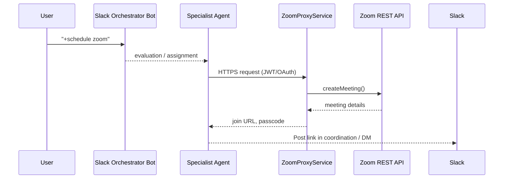

# Zoom API Integration Plan

## Objective
Enable the multi-agent Slack system to schedule, start, and manage Zoom meetings autonomously, allowing specialists (e.g., **Grok** or **Writer**) to spin up a Zoom call when a task requires synchronous discussion or screen-sharing.

---

## Use-cases
1. **Ad-hoc Meeting Request**  
   A user asks the orchestrator: *"Please set up a quick Zoom with the research team at 3 PM."*
2. **Follow-up Discussion**  
   After completing an assignment, a specialist detects that a live demo is needed and proposes a Zoom.
3. **Recurring Stand-up**  
   Orchestrator creates a daily Zoom meeting and posts the link every morning.

---

## High-level Architecture


---

## Components to Add
| Layer | Component | Responsibility |
|-------|-----------|----------------|
| **Core** | `zoom_client.py` | Thin wrapper around Zoom REST endpoints we need (create, update, end meeting). |
| **Tools** | `zoom_tools.py` | `@tool` functions: `create_zoom_meeting`, `list_zoom_users`, etc. Injected with the authenticated Zoom client. |
| **Config** | `configs/zoom.yaml` | Zoom OAuth creds, default settings (duration, timezone, PM room toggle). |
| **Secrets** | `.env` | `ZOOM_CLIENT_ID`, `ZOOM_CLIENT_SECRET`, `ZOOM_ACCOUNT_ID`, etc. |
| **Proxy (optional)** | `zoom_proxy_service.py` | Small FastAPI service to handle OAuth refresh if direct token management in-process is messy. |

---

## Zoom Auth Strategy
1. **Server-to-Server OAuth (recommended)**  
   • Create a "Server-to-Server OAuth" app in Zoom Marketplace.  
   • Store client ID/secret & account ID in `.env`.  
   • Exchange for JWT on startup; refresh every hour.  
2. **User OAuth (fallback)**  
   If individual Zoom users need to authorise, implement the 3-leg flow and persist refresh tokens per user in `configs/`.  

---

## Implementation Steps
1. **Dependency**  
   Add `zoomus` or just use `requests` with the official REST docs.  
   Update `requirements.txt`.
2. **Core Client**  
   `src/integrations/zoom_client.py` with `create_meeting`, `delete_meeting`, etc.  
   Handles token refresh.
3. **Tool Module**  
   `src/tools/zoom_tools.py` registering:
   ```python
   @tool
   def create_zoom_meeting(topic: str, when: str, duration: int = 30) -> str: ...
   ```
4. **Specialist Updates**  
   Extend profiles (e.g., Researcher) to include the Zoom tools.  
   Update `SpecialistAgent._initialize_tools()` to inject Zoom client similar to Slack.
5. **New Prompts**  
   Orchestrator prompt template: "If the user asks for a call, use `create_zoom_meeting`."
6. **Permissions Check**  
   Add to `startup diagnostics` a Zoom ping that logs token expiry and account owner.
7. **Error Handling**  
   Catch `RateLimitError`; back-off with `Retry-After` header.
8. **Unit Tests**  
   Mock `zoom_client` responses; assert tool returns join URL.

---

## Milestones & Timeline
| Week | Goal |
|------|------|
| 1 | Choose auth flow, add `zoom_client.py`, store secrets. |
| 2 | Implement `zoom_tools.py`, unit tests. |
| 3 | Wire tools into specialists, update prompts, end-to-end test in staging workspace. |
| 4 | Production rollout, monitor logs, tweak rate-limits. |

---

## Risks & Mitigations
* **Rate limits (100 req/min)** – cache user lists, exponential back-off.  
* **Meeting sprawl** – auto-delete meetings older than N days via nightly cron.  
* **Time-zone ambiguity** – default to user's TZ if available, else config TZ.  
* **Security** – Mark meeting as "authenticated users only" by default; include passcode.

---

## Done-Definition
✔ Specialists can call `create_zoom_meeting` and the link appears in Slack within 5 s.  
✔ Meeting is visible in Zoom web portal.  
✔ Health-check logs Zoom token expiry < 1 day. 

# NOTE: SpecialistAgent injects:
#   _zoom_client  – instance of ZoomClient
#   _slack_client – slack_sdk.WebClient
# Do NOT import ZoomClient directly here. 

if _zoom_client is None:
    return "Zoom support is disabled (no client provided)" 