# Project Architecture & Code Audit

*Last updated: 2025-07-27*

---

## 1. High-Level Overview

This repository implements **two parallel attempts** at a Slack-native multi-agent assistant:

1. **Modern Orchestrator & Specialists** (`src/`)
   • Entry via `src/main.py` (or `python -m src.cli run`)  
   • A single *Orchestrator* Slack bot coordinates human requests and delegates tasks to *Specialist* bots (Researcher, Writer, Grok, …).  
   • Specialists run lightweight Finetuned wrappers around `smolagents` tools.

2. **Experimental RL Multi-Agent System** (`multi_agent_system.py`)
   • Earlier research prototype with reinforcement-learning-style bidding.  
   • *Not referenced* anywhere in the main flow and safe to delete or archive.

> The **Orchestrator path is the production one**; the RL prototype is redundant.

---

## 2. Runtime Flow (production path)

```mermaid
sequenceDiagram
    participant U as Slack User
    participant O as Orchestrator (BaseAgent)
    participant S1 as Specialist (Researcher)
    participant S2 as Specialist (Writer)
    participant S3 as Specialist (Grok)

    U->>O: <@orchestrator> *request*
    O-->>Coordination Channel: ping specialists for confidence reports
    loop Evaluation (≤8 s)
        S1-->>Coordination: "🧠 Researcher reporting: 90%"
        S2-->>Coordination: "🧠 Writer reporting: 10%"
        S3-->>Coordination: "🧠 Grok reporting: 80%"
    end
    O->>Coordination: "ASSIGNED: <@Researcher> …"
    S1->>User/Thread: Performs work (may call Slack tools)
```



Key timing/threads:
• Each Slack bot (`BaseAgent`) maintains its own `SocketModeHandler` in a Python thread.  
• `main.py` registers handlers **dynamically** for every specialist discovered in `configs/agents/`.

---

## 3. Detailed File & Module Guide

### 3.1 Root level
| Path | Purpose | Notes |
|------|---------|-------|
| `multi_agent_system.py` | RL bidding prototype (LearningAgent / ConfidenceNetwork) | *Unused* in main flow — archive/delete. |
| `requirements.txt` | Runtime deps; includes `edge-tts` (TTS) but no STT. | Review for unused packages (e.g., `torch`, `numpy`, `scikit_learn` only needed by RL prototype). |

### 3.2 `src/` package

| File | Role | Key APIs |
|------|------|----------|
| `src/main.py` | **Entry point** when launched via CLI; boots Orchestrator & Specialists, registers message handlers, and manages task assignment. | `load_config`, `check_and_assign`, handler functions |
| `src/cli.py` | Thin argparse wrapper exposing `list-features` and `run`. Provides plugin system for optional features (e.g., Zoom). |
| `src/agents/specialist_agent.py` | Generic specialist implementation.  
• Loads YAML profile  
• Dynamically imports declared tool modules  
• Wraps a `FriendlyCodeAgent` (tolerant smolagents) to interpret LLM output | `_initialize_tools`, `evaluate_request`, `process_assignment` |
| `src/core/base_agent.py` | Slack glue.  
Initialises a Slack Bolt `App`, adds verbose logging, and spawns a `ThreadSafeSocketModeHandler`. |
| `src/core/friendly_code_agent.py` | Patch of `smolagents.CodeAgent` that tolerates extra prose around the first tool-call line. |
| `src/core/profile_loader.py` | YAML loader with `${ENV}` substitution. |
| `src/core/utils.py` | Helper: `sanitize_mentions`, `format_context_for_ai`. |
| `src/integrations/zoom_client.py` | Minimal Zoom REST wrapper supporting *stub* vs *live*. |
| `src/tools/agent_tools.py` | Generic LLM-callable helper functions (web scrape, proof-read, etc.). |
| `src/tools/slack_tools.py` | Slack helper functions incl. **Text-to-Speech** (Edge-TTS). No STT present. |
| `src/tools/slack_helpers.py` | Tiny wrapper around `chat_postMessage` that respects thread context. |
| *(tests folder missing)* |

### 3.3 `configs/`
| Path | Description |
|------|-------------|
| `configs/system_config.yaml` | Central config — Slack tokens, channel IDs, API keys. Supports env var substitution. |
| `configs/agents/*.yaml` | One file per specialist (e.g., `grok_agent.yaml`). Declares `name`, `model_id`, `system_prompt`, and list of tool modules + functions. |

### 3.4 `docs/`
Contains planning doc `zoom_integration_plan.md`.

---

## 4. Redundant / Dead Code

| Item | Why Redundant | Recommendation |
|------|---------------|----------------|
| `multi_agent_system.py` + heavy deps (`torch`, `numpy`, `scikit_learn`, `sentence_transformers`) | Prototype not wired into `src/main.py`. Adds large binaries. | Remove from repo or move to `experiments/` branch. Trim deps from `requirements.txt` if removed. |
| `src/core/profile_loader.py` vs identical logic in `src/main.load_config` | Two YAML loaders doing the same job. | Keep one, import from utils. |
| `src/tools/agent_tools.web_search_tool` returns canned text (placeholder). | Low value; either implement real search via `duckduckgo_search` or delete. |
| Missing usage of `src/tools/slack_helpers.post` outside that file. | Delete or replace direct SDK calls with helper for consistency. |
| Edge-TTS in `requirements.txt` but only used in one optional tool; consider making it extras-require. |

---

## 5. Missing / Planned Features

| Feature | Status | Notes |
|---------|--------|-------|
| Speech-to-Text | ❌ Not implemented. No Whisper or STT libs present. |
| Zoom tools (`src.tools.zoom_tools`) | 🚧 Referenced in SpecialistAgent but file is missing; only client exists. |
| Unit tests / CI | ❌ None present. Recommend pytest + GitHub Actions. |
| Error monitoring | ❌ No Sentry or logging aggregator. |

---

## 6. Future Scaffolding

Suggested directory structure after cleanup:

```
slack-smolagents-bot/
├── src/
│   ├── core/            # Slack + agent framework
│   ├── agents/          # Specialist logic
│   ├── tools/           # LLM-callable helper functions
│   ├── integrations/    # External service clients (Zoom, future STT, etc.)
│   └── main.py          # Entrypoint (importable)
├── configs/
│   ├── system_config.yaml
│   └── agents/
├── docs/
├── tests/
│   └── ...
├── requirements.txt     # Slimmed; extras for TTS, RL prototype
└── README.md            # Usage instructions
```

---

## 7. Open TODO List

- [ ] Delete or archive `multi_agent_system.py`; if retained, move deps to `requirements-rl.txt`.
- [ ] Consolidate YAML loading (choose `core.profile_loader.load_system_config`).
- [ ] Implement missing `src/tools/zoom_tools.py` matching `ZoomClient` methods.
- [ ] Replace placeholder `web_search_tool` with real search using `duckduckgo_search`.
- [ ] Add speech-to-text support (e.g., OpenAI Whisper API) if required.
- [ ] Write pytest coverage for `SpecialistAgent.evaluate_request` branch logic.
- [ ] Configure GitHub Actions workflow: *lint → test → build*.

---

## 8. At-a-Glance Dependency Health

| Package | Used In | Keep? |
|---------|---------|-------|
| torch / numpy / sklearn | Only RL prototype | Remove when prototype removed |
| edge-tts | `slack_tools.slack_tts_tool` | Optional — mark as extra |
| rich / yaspin / alive-progress | CLI UX | Keep |

---

## 9. Recent Fixes and Enhancements (2025-07-27)

### Deep Research Functionality
- **Fixed**: Deep research tool now properly handles DuckDuckGo rate limits
- **Added**: Automatic delays between searches to prevent rate limiting
- **Enhanced**: Direct execution of deep_research_tool in Grok agent for research queries
- **Improved**: Topic extraction from various query formats ("research on", "deep dive", etc.)

### Rate Limit Handling
- **Implemented**: Graceful handling of DuckDuckGo rate limits with user-friendly error messages
- **Added**: Time delays in web_search_tool and deep_research_tool to avoid rate limits
- **Enhanced**: Partial results returned when rate limits are hit mid-research

### Direct Execution Approach
- **Optimization**: Grok agent now directly executes deep_research_tool for research queries
- **Benefit**: Bypasses LLM interpretation issues for more reliable results
- **Fallback**: Automatic fallback to web_search_tool on deep research failures

### FriendlyCodeAgent Enhancements
- **Added**: Proper fallback mechanism when smolagents is unavailable
- **Implemented**: Manual tool call extraction from model responses
- **Support**: Multiple tool invocation formats (bare calls, backticks, code blocks)
- **Enhanced**: Flexible argument parsing for both positional and keyword arguments

### Error Handling Improvements
- **Fixed**: Model errors now caught and handled gracefully
- **Added**: Fallback responses to ensure users always receive feedback
- **Enhanced**: Better error messages for string parsing issues in tool execution

---

*End of report.*
